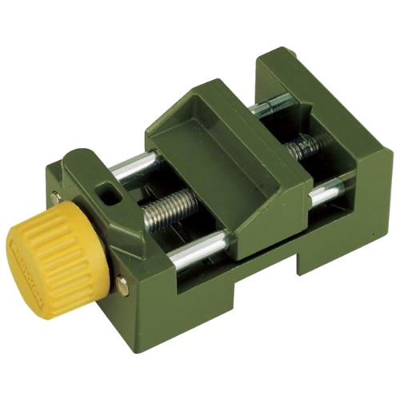

The vise

While trying to design a truly parametric vise, I found out that I need some sort of constraints.

Here are some random issues I encountered:

1. If the walls are too thin, then if I'll 3d print it, it will break.

2. The rails and the leadscrew need to allow for stiff walls all around them, so
they don't intersect, or leave to little room for the active side of the vise ->
the part that actually grips something.

3. If the length of the vise is not enough, coupled with the width of the walls,
then the sliding jaw will be too narrow and actually useless.

One idea will be to extract the dimensions from a real working vise. 
The inspiration for the parametric vise is a [Proxxon MS4](https://amzn.to/2ZHTjcJ). 

Image | Dimensions
---|---
 | baseLength = 85.25mm;    baseWidth = 51mm;    baseWidth = 51mm;    baseHeight = 36mm;    wallThickness = 12.5mm;    leadscrewHoleDiam = 8.25mm;    linearHoleDiam = 6.2mm;
I chose this because it's small enough to be easily 3d printed and doesn't have that many moving parts.

